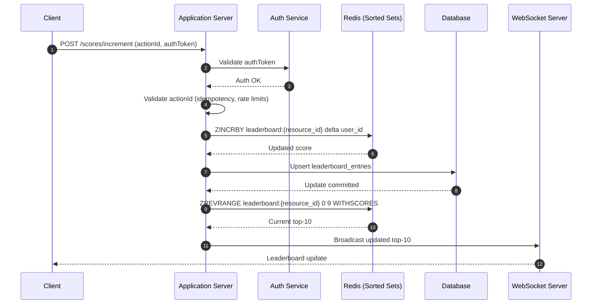
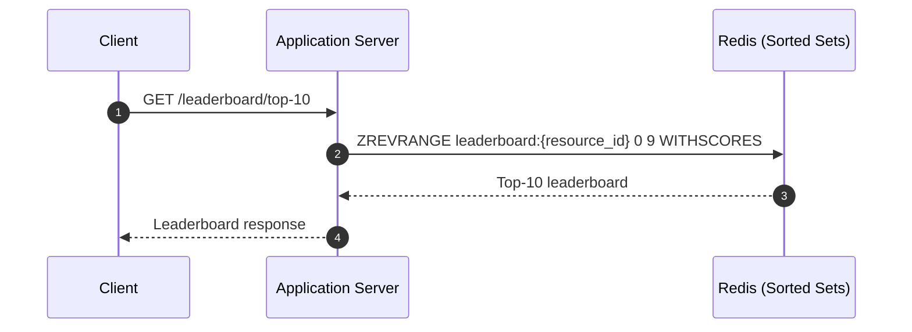
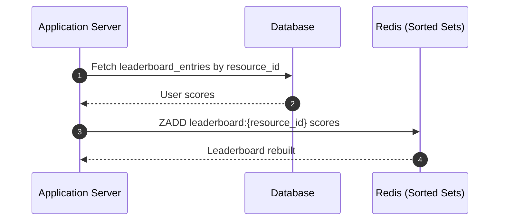

# Score Update & Leaderboard Retrieval Flow

```mermaid
sequenceDiagram
    autonumber

    participant Client
    participant API as Application Server
    participant Auth as Auth Service
    participant Redis as Redis (Sorted Sets)
    participant DB as Database
    participant WS as WebSocket Server

    %% User completes an action
    Client->>API: POST /scores/increment (actionId, authToken)

    %% Authentication & authorization
    API->>Auth: Validate authToken
    Auth-->>API: Auth OK

    %% Validate action & prevent abuse
    API->>API: Validate actionId (idempotency, rate limits)

    %% Atomic score update in Redis
    API->>Redis: ZINCRBY leaderboard:{resource_id} delta user_id
    Redis-->>API: Updated score

    %% Persist latest score
    API->>DB: Upsert leaderboard_entries
    DB-->>API: Update committed

    %% Detect leaderboard change
    API->>Redis: ZREVRANGE leaderboard:{resource_id} 0 9 WITHSCORES
    Redis-->>API: Current top-10

    %% Real-time push (only if changed)
    API->>WS: Broadcast updated top-10
    WS-->>Client: Leaderboard update
```

 
 
 
 

# Leaderboard Recovery Flow

```mermaid
sequenceDiagram
    autonumber

    participant Client
    participant API as Application Server
    participant Redis as Redis (Sorted Sets)

    Client->>API: GET /leaderboard/top-10
    API->>Redis: ZREVRANGE leaderboard:{resource_id} 0 9 WITHSCORES
    Redis-->>API: Top-10 leaderboard
    API-->>Client: Leaderboard response
```

 
 
 
 

# Recovering Leaderboards After Redis Failure

```mermaid
sequenceDiagram
    autonumber

    participant API as Application Server
    participant DB as Database
    participant Redis as Redis (Sorted Sets)

    %% Redis is empty or lost
    API->>DB: Fetch leaderboard_entries by resource_id
    DB-->>API: User scores

    %% Rebuild Redis leaderboard
    API->>Redis: ZADD leaderboard:{resource_id} scores
    Redis-->>API: Leaderboard rebuilt
```
